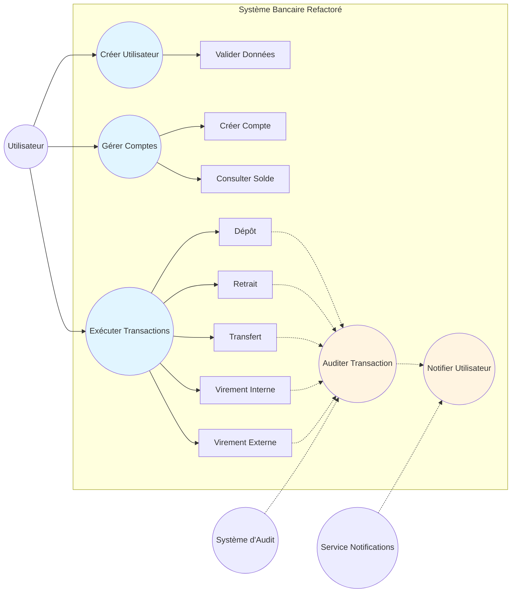

# Diagrammes UML

## 1. Diagramme de Classes

```mermaid
classDiagram
    class User {
        -String id
        -String username
        -String passwordHash
        -String email
        -LocalDateTime createdAt
        +isValid() boolean
    }
    
    class Account {
        -String id
        -String accountNumber
        -double balance
        -User owner
        -AccountType accountType
        -LocalDateTime createdAt
        +hasSufficientBalance(double) boolean
        +isValid() boolean
    }
    
    class Transaction {
        -String id
        -TransactionType type
        -double amount
        -Account fromAccount
        -Account toAccount
        -LocalDateTime timestamp
        -TransactionStatus status
        +isValid() boolean
        +formatForDisplay() String
    }
    
    class BankingService {
        -Map~String,User~ users
        -Map~String,Account~ accounts
        +createUser(...) User
        +getUserById(String) User
        +createAccount(...) Account
        +getAccountById(String) Account
    }
    
    class TransactionService {
        -Map~String,Transaction~ transactions
        -List~TransactionObserver~ observers
        +deposit(Account, double) Transaction
        +withdraw(Account, double) Transaction
        +transfer(Account, Account, double) Transaction
        +addObserver(TransactionObserver) void
    }
    
    class TransactionStrategy {
        <<interface>>
        +execute(Account, double, Account) Transaction
        +validate(...) boolean
        +getTransactionType() TransactionType
    }
    
    class DepositStrategy {
        +execute(Account, double, Account) Transaction
        +validate(...) boolean
        +getTransactionType() TransactionType
    }
    
    class WithdrawStrategy {
        +execute(Account, double, Account) Transaction
        +validate(...) boolean
        +getTransactionType() TransactionType
    }
    
    class TransferStrategy {
        +execute(Account, double, Account) Transaction
        +validate(...) boolean
        +getTransactionType() TransactionType
    }
    
    class UserFactory {
        +createUser(...) User
        +createUserWithId(...) User
    }
    
    class AccountFactory {
        +createAccount(...) Account
        +createAccountWithDetails(...) Account
    }
    
    class TransactionObserver {
        <<interface>>
        +onTransactionCompleted(Transaction) void
        +onTransactionFailed(Transaction, Exception) void
    }
    
    class AuditLogger {
        -List~String~ auditLog
        +onTransactionCompleted(Transaction) void
        +onTransactionFailed(Transaction, Exception) void
    }
    
    class NotificationService {
        -boolean emailNotificationsEnabled
        +onTransactionCompleted(Transaction) void
        +onTransactionFailed(Transaction, Exception) void
    }
    
    class ConfigurationManager {
        -static ConfigurationManager instance
        -boolean auditEnabled
        -boolean emailNotificationsEnabled
        +getInstance() ConfigurationManager
        +isAuditEnabled() boolean
        +setEmailNotificationsEnabled(boolean) void
    }
    
    class BusinessException {
        -String errorCode
        +getErrorCode() String
    }
    
    class ValidationException {
        -String fieldName
        +getFieldName() String
    }
    
    class InsufficientFundsException {
        -String accountId
        -double currentBalance
        -double requestedAmount
    }
    
    User "1" --> "*" Account : owns
    Account "1" --> "*" Transaction : fromAccount
    Account "1" --> "*" Transaction : toAccount
    BankingService --> UserFactory : uses
    BankingService --> AccountFactory : uses
    TransactionService --> TransactionStrategy : uses
    TransactionService --> TransactionObserver : notifies
    TransactionStrategy <|.. DepositStrategy : implements
    TransactionStrategy <|.. WithdrawStrategy : implements
    TransactionStrategy <|.. TransferStrategy : implements
    TransactionObserver <|.. AuditLogger : implements
    TransactionObserver <|.. NotificationService : implements
    ValidationException --|> BusinessException : extends
    InsufficientFundsException --|> BusinessException : extends
```

## 2. Diagramme de Cas d'Utilisation

## Légende

- **User** : Représente un utilisateur du système
- **Account** : Représente un compte bancaire
- **Transaction** : Représente une opération financière
- **BankingService** : Service de gestion des utilisateurs et comptes
- **TransactionService** : Service de gestion des transactions
- **Strategy Pattern** : Différentes stratégies pour les transactions
- **Factory Pattern** : Création centralisée d'entités
- **Observer Pattern** : Notification et audit des transactions
- **Singleton Pattern** : Configuration globale de l'application
